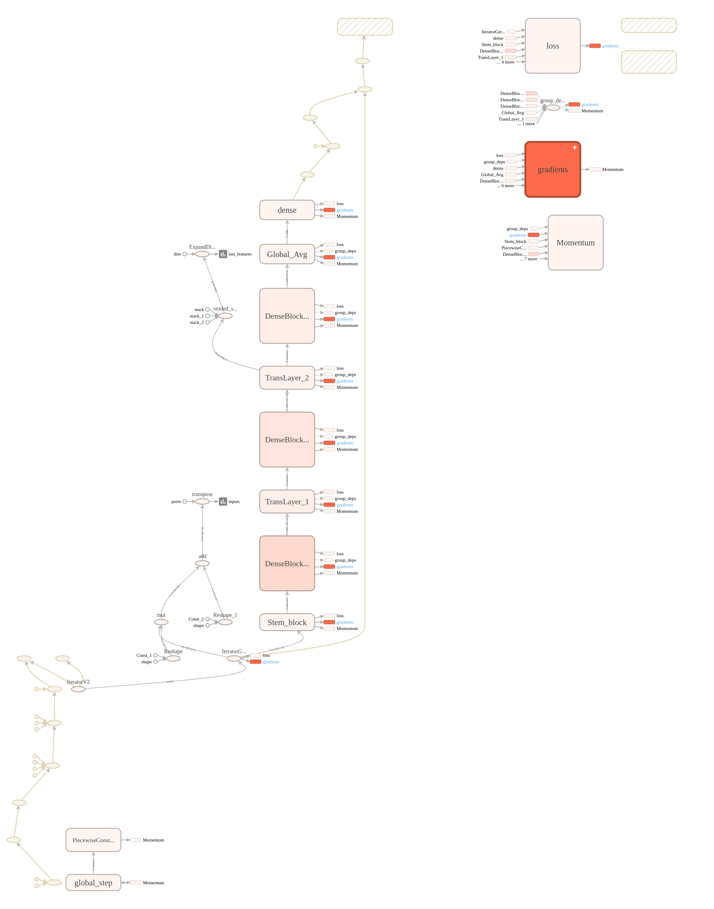

This tensorflow implementation code is based on [
Densely Connected Convolutional Networks](https://arxiv.org/pdf/1608.06993.pdf).

### FEATURES:
* Using tf.Dataset and tf.estimator which has better computational efficiency and more concise code
* Using the tf.keras.layers(not include dropout and batch_normalization) which has a good visualization in Tensorboard
* Add the Compute time Graph

### Result
1. Adding a compute graph which inclding time and memory

2. Its accuracy rate can reach 94.33% using 
data augmentation in cifar10.

### Manual
you only run `experiment.py` to get the result.
```
python experiment.py
```
***Notice:***
Maybe it will have a error like `"Couldn't open CUDA library libcupti.so.8.0 "`.You need to add  `/usr/local/cuda/extras/CUPTI/lib64/` to your `LD_LIBRARY_PATH`. For detail, you can find [there](https://github.com/tensorflow/tensorflow/issues/8830)
